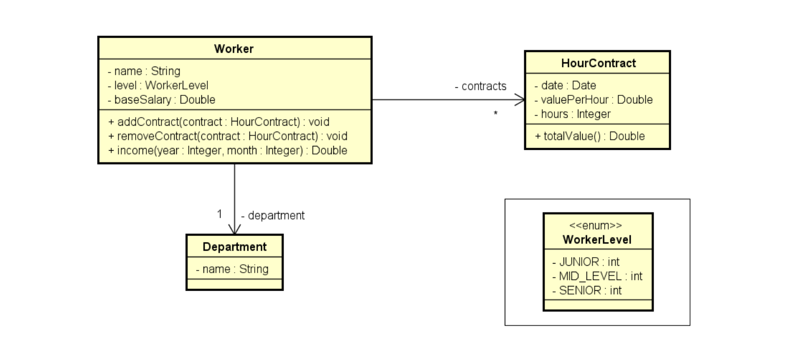
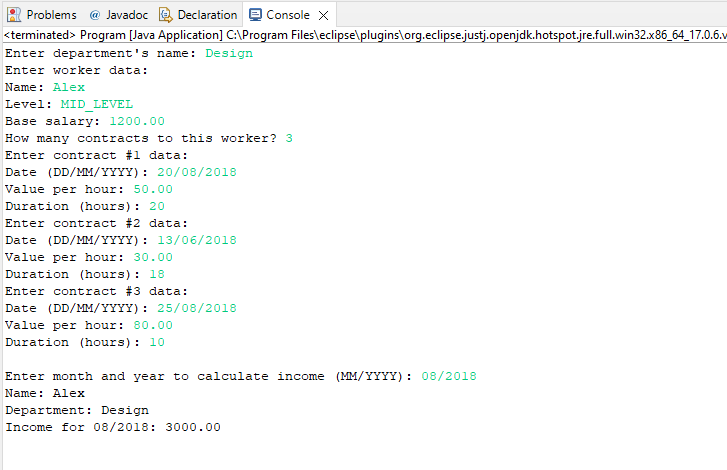

# Salary_Calculation_Java
Program to read data from a worker with N contracts (N provided by the user). Then, request of the user for a month and show what the employee's salary was that month

## UML

## Implementation

[WorkerLevel](https://github.com/ThiagSampaio/Salary_Calculation_Java/blob/main/Salary_Calculation/src/entities/WorkerLevel.java)

[Department](https://github.com/ThiagSampaio/Salary_Calculation_Java/blob/main/Salary_Calculation/src/entities/Department.java)

[HourContract](https://github.com/ThiagSampaio/Salary_Calculation_Java/blob/main/Salary_Calculation/src/entities/HourContract.java)

[Worker](https://github.com/ThiagSampaio/Salary_Calculation_Java/blob/main/Salary_Calculation/src/entities/Worker.java)

[Main](https://github.com/ThiagSampaio/Salary_Calculation_Java/blob/main/Salary_Calculation/src/applicaltion/Program.java)

## Result

